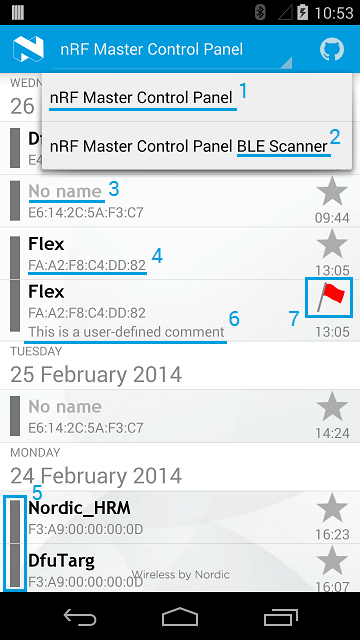

nRF-Logger-API
==============

The library allows to easily create custom log entries from your application in the nRF Logger. It is being used by nRF Master Control Panel and nRF Toolbox, that are available on Google Play.
The logger may be used for debugging purposes, as LogCat is not always available.

nRF Logger is available for Android 4.1.* and newer.

###Features
1. Create log session from your application
2. Append log entries to the session
3. 5 log levels are available: DEBUG, VERBOSE, INFO, WARNING, ERROR
4. Open the log in nRF Logger for viewing

###Example
The example project may be found in samples folder. It contains a simple application that shows how to create a log session:

    mLogSession = Logger.newSession(getActivity(), key, name);
	
and add entries:

    Logger.log(mLogSession, Level.INFO, text);
    Logger.e(mLogSession, R.string.error, someArg);
   
If nRF Logger application is not installed on the device those methods does nothing.

###Basic information

(1) When you create your first log session from your application its name will be added to nRF Logger drop-down menu.

    mLogSession = Logger.newSession(getActivity(), key, name);

(2) You may create multiple folders for different components of your application by creating a session with a profile name. It will be concatenated with the application name and visible as different entry in the drop-down menu.

    mLogSession = Logger.newSession(getActivity(), "Profile Name", key, name);

(3) The "name" parameter is shown as a title. If name is null, "No name" will be shown.

(4) The "key" parameter is used to group log sessions from the same day together. The "key" parameter may not be null.

(5) Log sessions from the same day with the same "key" value are grouped as shown on the picture.

(6) nRF Logger API allows you also to add a comment to a log session.

    Logger.setSessionDescription(mLogSession, "This is a comment");

(7) You may also mark a session with one of 6 symbols.

    Logger.setSessionMark(mLogSession, Logger.MARK_FLAG_RED);
