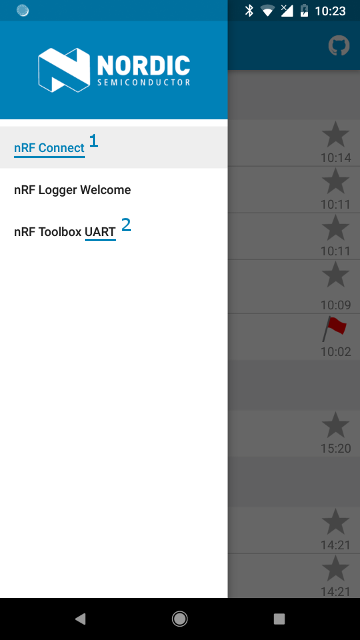
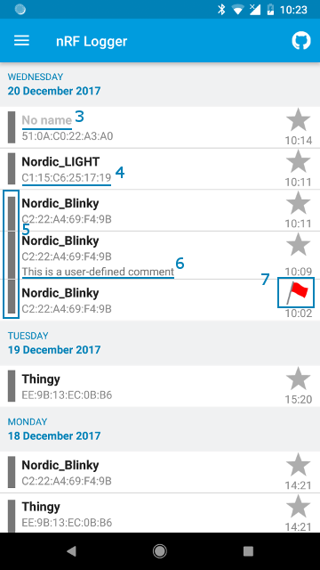

# nRF Logger Library

[  ](https://bintray.com/nordic/android/nrf-logger-api/_latestVersion)

The library allows to easily create custom log entries from your application in the 
[nRF Logger](https://play.google.com/store/apps/details?id=no.nordicsemi.android.log). 
It is being used by nRF Connect and nRF Toolbox, that are available on Google Play.
The logger may be used for debugging purposes, as LogCat is not always available.

nRF Logger is available for Android 4.2.* and newer.

### Usage
The nRF Logger API library is available on JCenter and Maven Central repositories. 
For Android Studio, add the following dependency to your component's *gradle.build* file:

```Groovy
implementation 'no.nordicsemi.android:log:2.3.0'
```

For easy integration with [Timber (4.7.1)](https://github.com/JakeWharton/timber), use this instead:

```Groovy
implementation 'no.nordicsemi.android:log-timber:2.3.0'
```

If your project is NOT migrated to AndroidX, use version 2.2.0.

If you use proguard, the following line will be automatically added to your proguard rules:

```-keep class no.nordicsemi.android.log.** { *; }```

### Features
1. Create log session from your application
2. Append log entries to the session
3. 6 log levels are available: DEBUG, VERBOSE, INFO, APPLICATION*, WARNING, ERROR
4. Open the log in nRF Logger for viewing
 
APPLICATION level added in version 2.0 of the library.

### Timber integration
After importing log-timber dependency, plant the 
[nRFLoggerTree](https://github.com/NordicSemiconductor/nRF-Logger-API/blob/master/log-timber/src/main/java/no/nordicsemi/android/log/timber/nRFLoggerTree.java), 
as described on [Timber](https://github.com/JakeWharton/timber) website.

#### Important
1. The log-timber library uses `@NonNull` and `@Nullable` from *androidx.annotation*, 
   instead of ones from *org.jetbrains.annotations*, like Timber does.
2. Log levels that Timber uses are incompatible with those in nRF Logger. 
   In Timber, the APPLICATION level is missing, and DEBUG has higher priority then VERBOSE.
3. Using Timber's (e.g. `Timber.i(...)`) API it is not possible to log on APPLICATION level.
4. Logs logged with `Log.VERBOSE` priority will get VERBOSE log level, so will be upgraded.
5. Logs logged with `Log.DEBUG` priority will get DEBUG level, so will be downgraded.
6. Tags will be added before the message: `[TAG] message`.

### Example
The example project may be found in samples folder. It contains a simple application that shows 
how to create a log session:
```java
logSession = Logger.newSession(context, key, name);
```
and add entries:
```java
Logger.log(logSession, Level.INFO, text);
Logger.e(logSession, R.string.error, someArg);
```   
If nRF Logger application is not installed on the device those methods does nothing.

### Basic information

 

(1) When you create your first log session from your application its name will be added to nRF Logger 
    drop-down menu.
```java
logSession = Logger.newSession(context, key, name);
```
(2) You may create multiple folders for different components of your application by creating a session 
    with a profile name. It will be concatenated with the application name and visible as different 
    entry in the drop-down menu.
```java
logSession = Logger.newSession(context, "Profile Name", key, name);
```
(3) The "name" parameter is shown as a title. If name is null, "No name" will be shown.

(4) The "key" parameter is used to group log sessions from the same day together. The "key" parameter may not be null.

(5) Log sessions from the same day with the same "key" value are grouped as shown on the picture.

(6) nRF Logger API allows you also to add a comment to a log session.
```java
Logger.setSessionDescription(logSession, "This is a comment");
```
(7) You may also mark a session with one of 6 symbols.
```java
Logger.setSessionMark(logSession, Logger.MARK_FLAG_RED);
```  
## Version 2.0

### Local Log Content Provider

The version 2.0 introduced the **LocalLogContentProvider** class which may be used to keep logs even 
if the nRF Logger application is not installed. Local log database is a limited version of the one 
in nRF Logger. It does not support multiple applications as the new provider is designed to work only 
in one application. Also marking session with a flag/star or adding a description is not supported.

To use the LocalLogContentProvider you must extend extend this class in you project and add its 
definition to the *AndroidManifest.xml* file:
```xml
<provider
    android:name="com.example.log.provider.MyLogContentProvider"
    android:authorities="com.example.log"
    android:exported="true" />
```        
If you want to use the local logger in threads that are owned by other applications, e.g. by Bluetooth 
scanner callbacks, you must set the **exported** attribute to *true*. Otherwise the Bluetooth application 
will not have the permission to add log events. You may also use **Handler** object to log in 
UI thread of your application.

### ILogSession

In order to make the `LocalLogSession` work, a new interface has been created - `ILogSession`. 
Both `LogSession` and `LocalLogSession` implement this interface. You will need to change the 
type of your `mLogSession` object to `ILogSession` when migrating to version 2.0 of the library.
